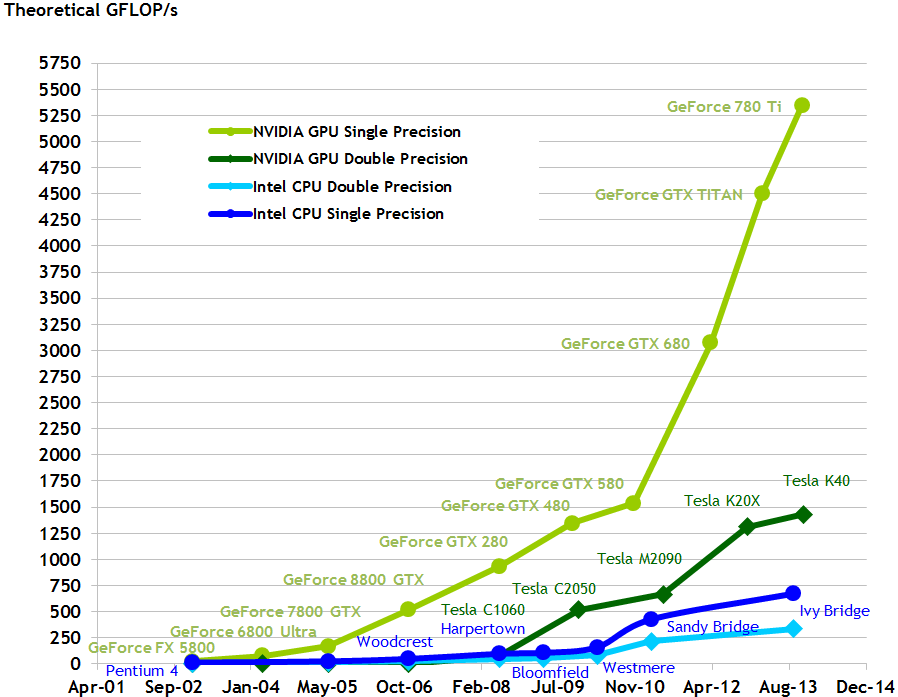
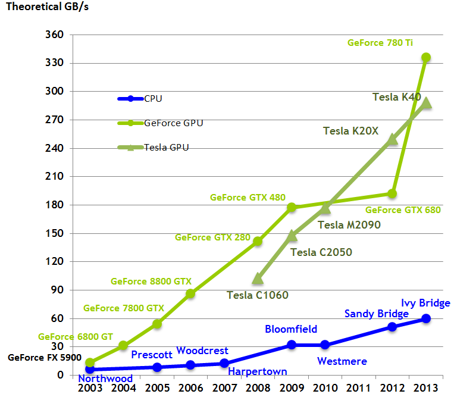
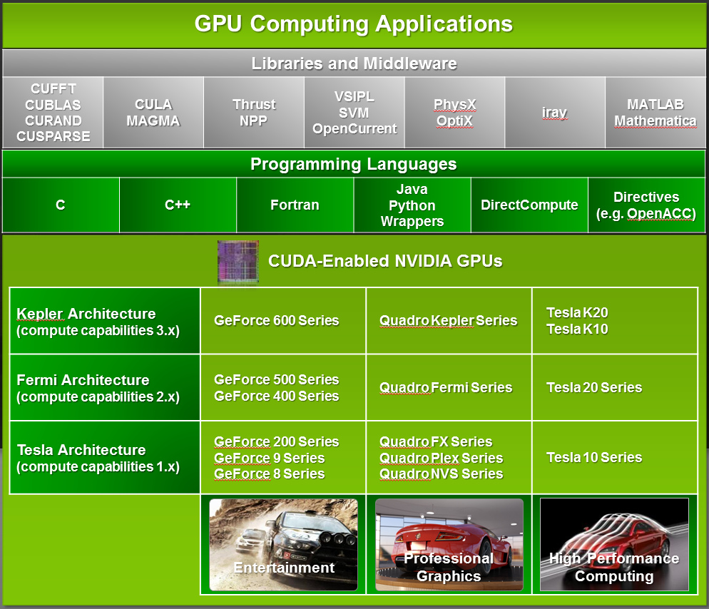
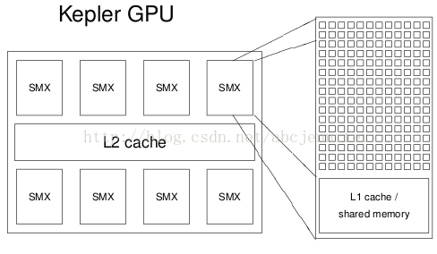

目前在207.207.90.204机器上搭建了一个GPU的环境，系统是Ubuntu，cuda的版本是7.0,目前最新的版本是7.5。

具体怎么搭建还是参考官方文档[documents](http://docs.nvidia.com/cuda/index.html#axzz4DzlUApap)

用户名和密码都是Ubuntu。root用户的密码是123456。

## 1、Introduction

### 1、1 From Graphics Processing to General Purpose Parallel Computing

由于市场对实时性、3D高清图像的无限制需求的驱动，可编程的GPU(Graphic Processor Unit)已经发展成为一个高度并行的、多线程、多core的处理器。拥有大计算功率和高网络带宽。如下图所示：

图1对比了cpu和GPU每秒的浮点运算，图2对比了cpu和GPU的网络带宽。

CPU和GPU的浮点运算的差异性原因在于GPU是专门用于计算密集型的(compute-intensive)和高度并行的计算，这也是图像渲染的特点。这样的设计可以使用更多的晶体管来专注于数据处理而不是数据缓存和流程控制。如图3所示：

更特殊的是，GPU是更适用于处理能够数据并行计算的问题。同样的程序可以并行的在多个数据单元上(data element)执行，这样的程序一般是高计算密度，也就是计算操作和内存操作的比值比价大。

因为每个数据单元执行同样的程序，所以对于复杂的流程控制操作并不太需要。因为计算密度比较高，所以内存访问的延迟会隐藏在计算中而不是大数据缓存中。

数据并行操作把数据单元映射到并行处理的线程中。许多处理大数据集的应用都可以了使用数据并行编程模型来加速计算。在3D模型渲染中，大量的像素点集被映射到并行线程中。同样的，图像和视频处理的应用中，比如渲染图像的后期处理，视频的编解码，图像缩放，立体视觉和模式识别中可以把图像块和像素映射到并行处理线程中。实际上，在图像渲染和处理领域外的很多算法都可以用数据并行来处理。比如一般的信号处理和物理模拟计算金融学和计算生物学。

### 1.2 CUDA：A General-Purpose Parallel Computing Platform and Programming Model

在2006年11月份，NVIDIA引入了CUDA，一个通用的并行计算框架和编程模型来提升NVIDIA的GPU的并行计算引擎，用来解决许多复杂的计算问题并且比CPU更有效。

CUDA是一个允许开发者使用C语言或者更高级的语言的软件开发环境，如下图4所示，别的语言，别的应用编程接口或者直接的方法调用都是支持的。

### 1.3 A Scalable Programming Model

多核CPU和GPU的到来意味着主流处理芯片都是并行处理系统。更远的说，这也是扩展了摩尔定律。
现在的挑战是开发应用软件来显式的扩展并发度，来利用不断增长处理核心数量。比如3D图像应用利用多核GPU显式的提升了并行度。

CUDA并行模型的设计就是用来给哪些熟悉标准的编程语言比如C的编程人员很低的学习曲线。

CUDA内部的核心有三个概念：
* 分层的线程组(a hierarchy of thread groups)
* 共享内存( shared memories)
* 栅栏同步(barrier synchronization)

这样暴露给编程人员的是一个很小的语言扩展集合。

这几个抽象概念提供了把细粒度的数据并行和线程并行嵌入到粗粒度的数据并行和任务并行。我们会引导程序员把问题分割成粗粒度的子任务，每个子任务都可以独立并行的在线程块中运行，并且每个子任务都可以在所有的并发的线程块中合作的解决。

这样的分解保留了语言的表达力，通过允许线程合作的解决子任务，同时可以自动扩展。
确实的，线程中的每一个块都是可以通过多核GPU来调度，调度的顺序可以是任何顺序，比如并发的，比如顺序的。那么一个编译好的CUDA程序可以执行在任何数量的多核处理器，如图5所示，而且只有运行时系统才需要知道物理处理器核心的数量。

GPU建立在一组多处理器（SMX，Streaming Multiprocessors）附近。
一个SMX的配置：
* 192 cores（都是SIMT cores（Single Instruction Multiple Threads） and 64k registers（如下图所示）GPU中的SIMT对应于CPU中的SIMD（Single Instruction Multiple Data）
* 64KB of shared memory / L1 cache
* 8KB cache for constants
* 48KB texture cache for read-only arrays
* up to 2K threads per SMX

每个multi-thread程序的execution kernel instance（kernel定义见下一节,instance指block）在一个SMX上执行，一个多线程程序会分配到blocks of threads（每个block中负责一部分线程）中独立执行。所以GPU中的处理器越多执行越快（因为如果SMX不够给每个kernel instance分配一个，就要几个kernel抢一个SMX了）。具体来讲，如果SMX上有足够寄存器和内存（后面会讲到，shared memory），就多个kernel instance在一个SMX上执行，否则放到队列里等。

GPU工作原理：首先通过主接口读取中央处理器指令，GigaThread引擎从系统内存中获取特定的数据并拷贝到显存中，为显存控制器提供数据存取所需的高带宽。GigaThread引擎随后为各个SMX创建和分派线程块（warp, 详细介绍见SIMT架构或者CUDA系列学习（二）），SMX则将多个Warp调度到各CUDA核心以及其他执行单元。在图形流水线出现工作超载的时候，GigaThread引擎还负责进行工作的重新分配。

## 2、Programming Model

这一节主要介绍CUDA编程模型背后的主要概念。用C语言来描述，更多的CUDA c接口扩展描述可以参考[Programming Interface](http://docs.nvidia.com/cuda/cuda-c-programming-guide/index.html#programming-interface)

### 2.1 Kernels

CUDA C 通过运行程序员定义C的函数，这样就扩展了C，我们称之为Kernels, Kernels被调用时
就会在N个不同的CUDA线程中执行N次(一个CUDA线程执行一次，那么一共就是次)。普通的C函数都是执行一次。

kernel用__global__这个声明符号来定义，CUDA线程执行给定的kernel的调用的数据通过new<<<...>>>来指定(see [C Language Extensions](http://docs.nvidia.com/cuda/cuda-c-programming-guide/index.html#c-language-extensions))。

每个执行kernel的线程给定一个唯一的线程ID，可以通过在kernel中内置的threaIdx变量来获取。

接下来的代码求两个长度为N的向量的和，并且把结果存储在向量C中。

      // Kernel definition
      __global__ void VecAdd(float* A, float* B, float* C)
      { int i = threadIdx.x;
        C[i] = A[i] + B[i];
      }
      int main()
      {
        ...
        // Kernel invocation with N threads
        VecAdd<<<1, N>>>(A, B, C);
        ...
      }

这里N个线程中的每个都执行VecAdd()，并且是向量中的其中一对的和。

### 2.2 Thread Hierarchy

为了方便起见，threadIdx是一个3维(3-component)的向量,那么线程就可以用一维、二维、三维的线程索引来标记，组成了一维、二维、三维的线程块。这样就提供了一个自然的方式来计算向量、矩阵、卷的元素。

线程的索引和线程的ID彼此之间相关：对于一个一维的块，他们是一样的，
